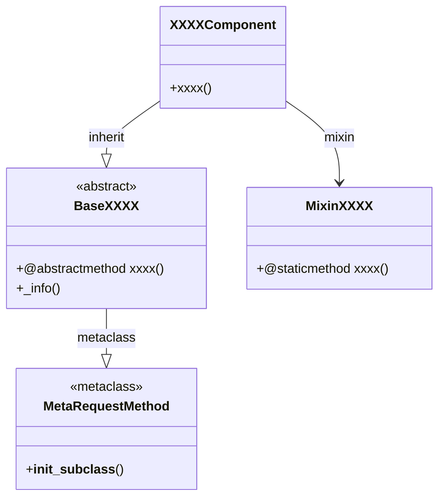

# StatJAX

English | [中文](README_Chinese.md)

## 1.introduce
### 1.1 StatJAX positioning
+ StatJAX is a statistical model algorithm package based on the jax technology stack starting from the matrix calculation level and implemented from the bottom up. I initiated this open source project for the following three purposes:
	+ Real knowledge comes from practice, and you can deepen your understanding of statistical model algorithms by "reinventing the wheel".
	+ Stand on the shoulders of giants and take a small step forward. Based on the JAX technology stack, expand the implementation boundaries of well-known statistical algorithm packages such as statsmodels and scikit learn (such as GPU implementation)
	+ It provides a learning reference for students of probability and statistics.

## 2.design
### 2.1 core concepts
+ **base (module base class)**: base is a module base class implemented using metaprogramming technology. Its main function is to standardize the method behavior of each module, so that different algorithm engineers can jointly develop research algorithms under the same standard, and agile algorithm operation and maintenance and development.
+ **component (algorithm component)**: component is the specific implementation of each algorithm, inherited from the base module base class (different algorithm base class specifications have different method behaviors), its main function is used to implement specific algorithms, and is the main operation, maintenance and development part of the algorithm engineer, and can be independently opened.
+ **algo (application component)**: algo is an open component that combines various algorithm components based on mixins. Its main function is to realize a complete algorithm application flow.

### 2.2 frame


+ **MetaRequestMethod**: a metaclass based on `__init_subclass__`, which checks whether a subclass implements all agreed abstract methods before the class is created.
+ **BaseXXXX**: an abstract module base class, which standardizes the unified interface methods of each module (such as `train`, `reasoning`, `_info`).
+ **XXXXComponent**: the concrete implementation of an algorithm, the main technical JAX technology stack.
+ **MixinXXXX**: the concrete implementation of algorithm auxiliary functions, based on the Mixin mode and static methods.

## 3.use
### 3.1 How to get
```bash
git clone https://github.com/redblue0216/statjax.git
cd statjax
conda create -n statjax python=3.13 -y
conda activate statjax
python build.py --clean --install
```

### 3.2 How to use
```python
import jax
import jax.numpy as jnp
from statjax.regression import HouseholderOLSComponent

# Prepare the training data (column full rank design matrix A and observation labels b)
A_train = jax.random.normal(jax.random.PRNGKey(0), (100, 5))
b_train = A_train @ jnp.array([1.2, -2.1, 0.7, 3.3, -1.5])

# Train the OLS model and solve the optimal regression coefficients
ols = HouseholderOLSComponent()
x_hat, metrics = ols.train(A=A_train, b=b_train)

# Batch prediction on the test set
y_pred = ols.reasoning(A_test=A_train)
```

Run unit tests:

```bash
pip install pytest
python -m pytest -v
```

For the complete self-test process from scratch, see [StatJAX自我测试完整流程_SH_V001.md](design/StatJAX自我测试完整流程_SH_V001.md).

## 4.algorithm
### 4.1 Which algorithms and models are covered?

| Module | Component | Algorithm | Key features |
|:----|:----|:----|:----|
| regression | HouseholderOLSComponent | Ordinary least squares (OLS) solved by Householder QR decomposition: min ‖A·x − b‖₂², equivalently transformed into R·x̂ = Qᵀ·b | Optimal numerical stability (no condition number squaring); fully differentiable, JIT-compilable and GPU-accelerated based on JAX |

## 5.ChangeLog
<details>
<summary>Click to view ChangeLog</summary>

### Version-0.2.0
  - Added the regression component HouseholderOLSComponent (OLS linear regression based on Householder QR decomposition)
  - Added the unit test file statjax/tests/test_ols.py
  - Completed project-wide comments, integrating the design documents and the OLS algorithm document

### Version-0.1.1
  - Algorithm package framework development
</details>
