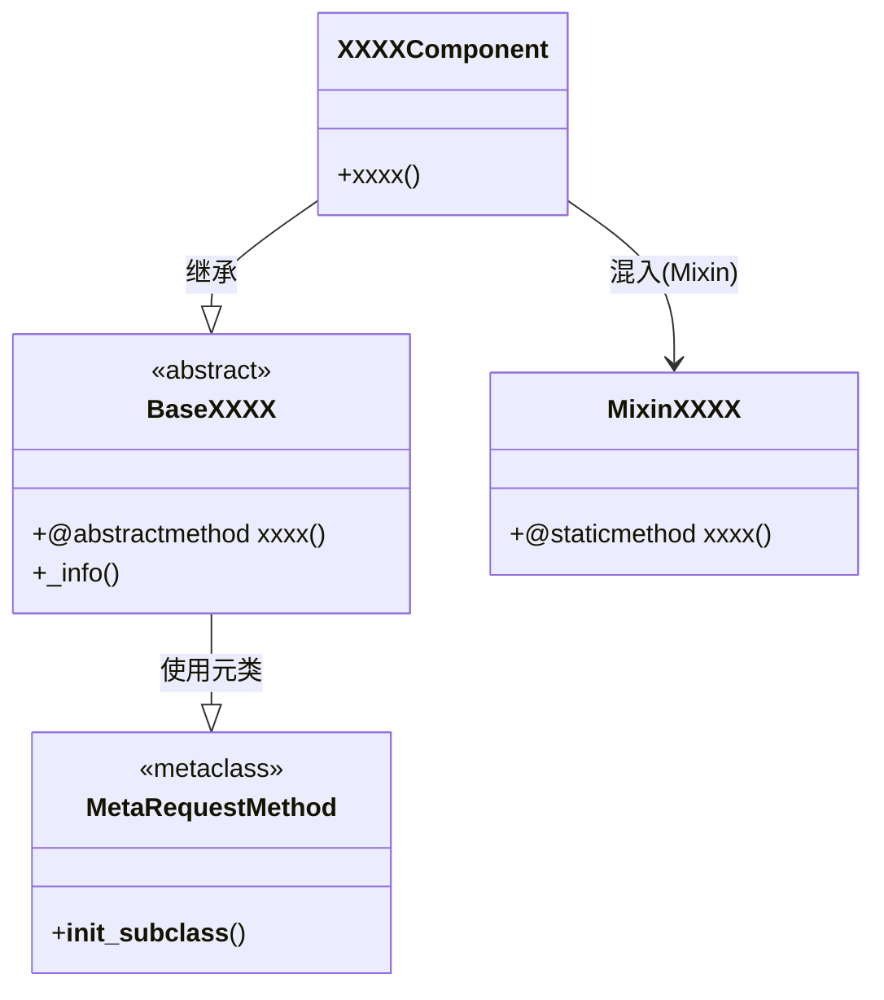

# StatJAX

[English](README.md) | 中文

## 1.介绍
### 1.1 StatJAX定位
+ StatJAX是基于JAX技术栈从矩阵计算层面开始，由下而上实现的统计模型算法包。我发起这个开源项目的目的有以下三点：
	+ 实践出真知，通过“重复造轮子”的方式，加深自己对统计模型算法的理解
	+ 站在巨人的肩上前进一小步，基于JAX技术栈，扩展statsmodels和scikit-learn等知名统计算法包的实现边界（如GPU实现）
	+ 抛砖引玉，为概率统计的学生们，提供一个学习的参考资料。

## 2.设计
### 2.1 核心概念
+ **Base（模块基类）**：Base是采用元编程技术实现的模块基类，主要功能用来规范各个模块的方法行为，便于不同算法工程师在同一个标准下共同开发研究算法，敏捷算法运维和开发。
+ **Component（算法组件）**：Component是各个算法的具体实现，继承自Base模块基类（不同算法基类规范的方法行为不同），主要功能用来实现具体算法，是算法工程师主要运维和开发部分，可独立开放。
+ **Algo（应用组件）**：Algo是对外开放组件，基于Mixin组合各类算法组件，主要功能用来实现完整的算法应用流。

### 2.2 框架


+ **MetaRequestMethod**：基于`__init_subclass__`的元类，在类创建前检查子类是否实现了全部约定的抽象方法。
+ **BaseXXXX**：抽象模块基类，规范各模块的统一接口方法（如`train`、`reasoning`、`_info`）。
+ **XXXXComponent**：算法的具体实现，主要技术JAX技术栈。
+ **MixinXXXX**：算法辅助功能的具体实现，基于Mixin模式和静态方法。

## 3.使用
### 3.1 如何获得
```bash
git clone https://github.com/redblue0216/statjax.git
cd statjax
conda create -n statjax python=3.13 -y
conda activate statjax
python build.py --clean --install
```

### 3.2 如何使用
```python
import jax
import jax.numpy as jnp
from statjax.regression import HouseholderOLSComponent

# 准备训练数据（列满秩设计矩阵A与观测标签b）
A_train = jax.random.normal(jax.random.PRNGKey(0), (100, 5))
b_train = A_train @ jnp.array([1.2, -2.1, 0.7, 3.3, -1.5])

# 训练OLS模型，求解最优回归系数
ols = HouseholderOLSComponent()
x_hat, metrics = ols.train(A=A_train, b=b_train)

# 测试集批量预测
y_pred = ols.reasoning(A_test=A_train)
```

运行单元测试：

```bash
pip install pytest
python -m pytest -v
```

从零开始的完整自我测试流程见 [StatJAX自我测试完整流程_SH_V001.md](design/StatJAX自我测试完整流程_SH_V001.md)。

## 4.算法
### 4.1 覆盖哪些算法和模型

| 模块 | 组件 | 算法 | 关键特性 |
|:----|:----|:----|:----|
| regression | HouseholderOLSComponent | 基于Householder QR分解求解普通最小二乘（OLS）：min ‖A·x − b‖₂²，等价转化为 R·x̂ = Qᵀ·b | 数值稳定性最优（不放大条件数）；基于JAX全程可微、可JIT编译、可GPU加速 |

## 5.ChangeLog
<details>
<summary>点击查看ChangeLog</summary>

### Version-0.2.0
  - 新增回归组件HouseholderOLSComponent（基于Householder QR分解的OLS线性回归）
  - 新增单元测试文件statjax/tests/test_ols.py
  - 完成全项目注释，整合设计文档与OLS算法文档内容

### Version-0.1.1
  - 算法包框架开发
</details>
